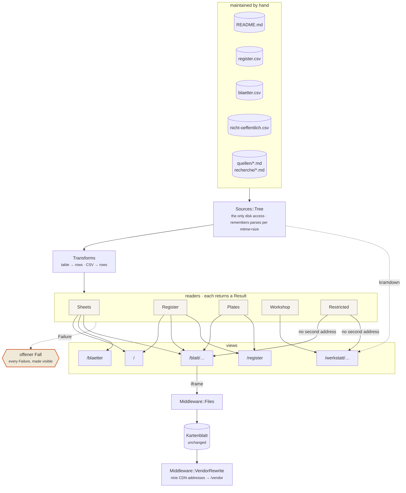

# DIERCKI — sternprodukt atlas

A world atlas in the manner of the Diercke classic, but of the Sternprodukt kind.
Blätter on Romania and Brandenburg, a Zeichenerklärung after the atlas model, and a
QGIS-Kartensatz.

`Inhalt.dc.html` is the same table of contents in the Sternprodukt look — grouped,
linked, with the notes you need while looking something up. This file stays the
machine-readable version.

> **A note on language.** Prose here is English; the cartographic and project
> vocabulary stays German and untranslated — *Blatt*, *Signatur*, *Schummerung*,
> *Zeichenerklärung*, *Quellenregister*, *belegt / abgeleitet / unbelegt*. That is the
> rule in `CLAUDE.md`, and a *Signatur* is not a "symbol".
>
> Two things in this file are **read by the application** and must not be translated:
> the three headings `## Blätter`, `## Weitere Blätter` and `## Präsentationen`
> (`Sources::Sheets::HEADINGS` matches them literally), and the description cells of
> those tables (they appear on the Schaukasten cards). Change a heading and the sheet
> list goes empty.

## Getting it running

A single Blatt needs nothing: open `Rumaenien-Physisch.html` in a browser and there it
is. It will pull d3 and topojson from a CDN, though.

For the whole application — home page, Schaukasten, Blattschau, Namensregister,
Werkstatt — there are two ways.

### With Ruby, without Docker

Needs Ruby 3.4 (rbenv: `rbenv install 3.4.2`, `.ruby-version` sits next to this file).

```sh
bundle install                 # gems into .bundle/gems, not into the system
ruby bin/vendor.rb             # once: the nine vendored libraries into .vendor/
bundle exec rackup             # → http://localhost:9292/  (Rack's own default)
```

`bin/vendor.rb` is the **only** step that needs a network. Everything after it works
offline. It verifies the two SRI hashes on the way and aborts if a file is not
byte-identical — otherwise the browser would refuse the script later without a word.

Tests: `bundle exec ruby -Itest test/web_test.rb`

### With Docker

Needs no Ruby on the machine.

```sh
docker compose --profile local up dev       # → http://localhost:9292/
```

`dev` mounts the working tree read-only: a change to a file is there on the next
request, without a restart and without a build step. To check what would actually ship:

```sh
docker compose --profile local up preview   # → http://localhost:9293/, tree from the image
```

Both sit behind the `local` profile and never start on the server.

### When it does not work

| Symptom | Cause |
|---|---|
| `/vendor/…` returns 404, Blätter stay blank | `ruby bin/vendor.rb` never ran |
| `bundle install` wants Ruby 3.4.2, you have 3.4.9 | The `Gemfile` only asks for `~> 3.4.0`; `.ruby-version` is the rbenv pin. Install that version or adjust the file |
| Gems missing inside the container | The host's `.bundle/config` points into the repo; the image sets `BUNDLE_APP_CONFIG` for that reason — do not override it |
| A page shows a box saying "offener Fall" | Not a bug but the design: a file or an assignment is missing, and the page says which |

## Blätter

Each Blatt is a standalone HTML file in the root, D3-based, with a Zeichenerklärung
and its sources in the footer.

| Datei | Inhalt |
|---|---|
| `Rumaenien-Physisch.html` | Physische Übersicht — Relief, Hypsometrie |
| `Rumaenien-Wirtschaft.html` | Wirtschaft — Rohstoffe, Industrie, Energie |
| `Rumaenien-Verkehr.html` | Hauptverkehrsnetz — Straßen, Bahnen, Donaudelta-Nebenkarte |
| `Banat-Liniennetz.dc.html` | Banat · Liniennetzplan — oktilinear, topologietreu, nicht lagetreu |
| `Rumaenien-Braunbaer.html` | Braunbär — Verbreitung, Streusignatur nach GBIF-Nachweisen |
| `Rumaenien-Landschaften.html` | Historische Landschaften |
| `Brandenburg-Landwirtschaft.html` | Brandenburg · landwirtschaftliche Nutzung — Hanf 2026 schlaggenau, Kartodiagramm je Kreis, Matrix-Legende, Nebenkarte Kyritz |
| `Brandenburg-Klima.html` | Brandenburg · Klima — Kartodiagramme, Walter-Lieth-Randspalte, Geländeklima-Nebenkarte. **Alle Werte noch unbelegt** |
| `Loreley-Relief.html` | Werkstattblatt: ein Gelände in vier Registern — Isohypsen, Hypsometrie, Schummerung, Böschungsschraffen. Geländemodell konstruiert |
| `Nikolais-Ort.dc.html` | Freiburger Hauptfriedhof, drei Blätter — Grundriss mit DTK10-Hintergrund, Person, Abschied. Kein Atlas-Bestandteil im engeren Sinn, folgt aber seinen Regeln |
| `Zeichenerklaerung.dc.html` | Zeichenerklärung des ganzen Atlas, Blatt für Blatt (Farbsystem, Relief, Gewässer/Siedlung/Schrift, Grenzen, Verkehr, Rohstoffe, Industrie/Energie, Landwirtschaft, …) |
| `QGIS-Kartensatz.dc.html` | Anleitung: Blätter in QGIS öffnen, drucken, um eigene Themen erweitern |
| `Zeichen-Naeherung.dc.html` | Messblatt zur Unicode-Näherung des Sternprodukt-Zeichens — misst Glyphenabdeckung live gegen U+FFFF |

## Weitere Blätter

In the root, following the same rules, but not part of the Kartenwerk.

| Datei | Inhalt |
|---|---|
| `Inhalt.dc.html` | Übersichtsblatt im Sternprodukt-Look — dieselbe Ordnung wie hier, nur gestaltet und mit Signaturen |
| `Deckel-Entwuerfe.dc.html` | Entwürfe für den Einband |
| `Kleiner-Gruss-aus-der-Kueche.dc.html` | Zwischenstand vom 7. August, zwei Blattausschnitte. Kein Atlas-Bestandteil |

## Präsentationen

| Datei | Inhalt |
|---|---|
| `praesentationen/Pitch-Hoehle-der-Loewen.dc.html` | Pitch-Deck zum QField-Bahnreiseplaner |
| `praesentationen/QField-Bahnreiseplaner.dc.html` | Workshop: QField als Bahnreise-Planer, zwölf Folien |
| `praesentationen/Reiseplaner-Vorschlag.dc.html` | Entscheidungsvorlage Reiseführer Banat & România, 12 Folien |
| `praesentationen/Reiseplaner-Roadmap.dc.html` | Technische Roadmap dazu, 4 Seiten (Arbeitsdokument) |
| `praesentationen/Reiseplaner-Reisebegleitung.dc.html` | Reisevorbereitung für die eigene Rumänien-Reise, 10 Folien |
| `praesentationen/Zeichensystem-Post-its.dc.html` | Das Zeichensystem des Atlas, neun Zettel |
| `praesentationen/Iteration-2-Konzept.dc.html` | Iteration 2 — Konzept vor Bau, zehn Folien. Offen: Zuschnitt A, B oder C |
| `praesentationen/Wireframe-A-Chips.dc.html` | Wireframe A · Themenchips über der Karte — absichtlich grau und unfertig |
| `praesentationen/Wireframe-B-Tabs.dc.html` | Wireframe B · Themenliste mit Tab-Leiste unten |
| `praesentationen/Wireframe-C-Split.dc.html` | Wireframe C · Karte oben, Trefferliste unten |
| `Gruss-an-Stefan-Waldmann.dc.html` | Persönliche Präsentation, kein Atlas-Bestandteil |

## Layout

```
atlas/
  signaturen.js       Signaturenkatalog (SVG per map object)
  SIGNATUREN.md       how the catalogue is built, rules for adding to it
  typenscale.js       type scale — seven steps, lower bound 5.5 pt
  farben.js           colour system — the single source of hex values in the atlas
  farben-paletten.rb  generates the .gpl palettes from farben.js
  register.csv        Namensregister of the volume, maintained by hand
  blaetter.csv        Blattschlüssel — which Blattnummer means which file
  BLAETTER.md         the reasoning; the numbers are abgeleitet, not belegt
  marke/              logo and handwritten wordmark
  GLOSSAR.md          the Blätter's technical terms, alphabetically
  paletten/           .gpl palettes for QGIS/GIMP, derived from farben.js
  quellen/            Quellenregister per Blatt (belegt / abgeleitet / unbelegt)
  geodaten/           scripts that turn raw deliveries into map data
  qgis/               QGIS-Kartensatz: basis/ (theme-neutral) + themen/ (one folder per Blatt)
                      themen/brandenburg-hanf/ doubles as the QField package for
                      fieldwork (instructions in the README there)

bin/                  tools — sync-report.rb compares the clone against the ZIP export,
                      vendor.rb fetches the nine vendored libraries,
                      pruefe-blaetter.rb checks the Blattschlüssel against sheet content
web/                  the web application (Roda, dry-rb) and its design
  app.rb              routes
  boot.rb             container (dry-system), root path, vendor directory
  lib/atlas/          readers, transforms, middleware
  templates/          ERB templates — they mirror the class names of Muster.dc.html
  site.css            design — owned by the design UI
  Muster.dc.html      every building block once — owned by the design UI
  site.js             enhancement: place the Signaturen, filter the Register
  nicht-oeffentlich.csv  paths that get no second address
test/                 minitest + rack-test
handarbeit/           only the human writes here — QGIS projects, survey GeoPackages
praesentationen/      decks (pitch, QField how-to) and wireframes
recherche/            research notes and recorded decisions
skills/               project-owned skills (belegstatus, atlas-kartenblatt, …)
uploads/              data and images the Blätter load at runtime
screenshots/          QA captures; three are embedded by "Kleiner Gruß aus der Küche"
wip/                  working store, including the ZIP export — globally ignored
_ds/                  the bound Sternprodukt design system (do not touch)
```

Not in the clone but in the design project: `scans/` — the reference scans of the
printed Diercke, around 60 MB. They are comparison material, no Blatt embeds them;
whoever needs them takes them out of the export.

Backlog and loose ends: `IDEEN.md`. What data is still missing from outside:
`DATENBEDARF.md`. Entry point for agents: `AGENTS.md`; binding rules: `CLAUDE.md`.

Colours and Signaturen go through `atlas/farben.js` and `atlas/signaturen.js` and
nowhere else — no new hex values, no ad-hoc symbols in individual Blätter. The `.gpl`
palettes are derived from them (`atlas/farben-paletten.rb`) and are not maintained by
hand.

## Generated geodata is versioned

The scripts under `atlas/geodaten/` build map data out of third-party deliveries.
**Their results live in the repo**, not just the scripts — even though that
contradicts the usual rule of not versioning what is generated.

The reason is the input side: CLC2018 arrives as several gigabytes through a portal,
nested as `Results/…geoPackage.zip/DATA/…gpkg`; the GBIF and Overpass queries return
something different depending on the day. A product whose input cannot be reliably
obtained again is effectively a source, and is treated as one. Otherwise whoever
clones pays the price: a Blatt that stays silently empty, and half a day spent looking
for the reason.

This covers `nutzung-*.geojson` (nine area classes, 12 MB, read by
`Rumaenien-Wirtschaft.html`), `friedhof-freiburg.geojson` and the datasets under
`atlas/qgis/themen/rumaenien-baer/daten/`.

Only the **intermediate stages** stay out — raw deliveries, unpacked archives, working
copies. What `.gitignore` excludes is justified there.

## Lookup tables without a build step

Tables a human maintains are read **at runtime** — by the Blatt as it loads, by QGIS as
an attribute join, by QField as a value list. No derived intermediate file that goes
quietly stale when an export script did not run:

| Table | read by | instructions |
|---|---|---|
| `atlas/geodaten/brandenburg/sorten.csv` | Landwirtschaftsblatt, QGIS theme `brandenburg-hanf` | `SORTEN.md` |
| `atlas/geodaten/brandenburg/klima-stationen.csv` | Klimablatt | `KLIMA.md` |
| `atlas/register.csv` | Namensregister of the web edition | header comment in the file |
| `atlas/blaetter.csv` | Blattschau and Register of the web edition | `BLAETTER.md` |

Where an entry is missing, nothing is guessed: the case gets a visible class of its own
("ungeklärt", "Ort nicht verifiziert"). Check scripts such as
`brandenburg/pruefe-hanf.rb` and `bin/pruefe-blaetter.rb` only **report** — they
generate nothing.

## Sources and evidence

Every number on a map has a row in the Quellenregister (`atlas/quellen/`), with the
status *belegt*, *abgeleitet* or *unbelegt*. Geometry from named datasets (Eurostat
GISCO, OSM, GBIF) goes into the footer of the Blatt instead.

## QGIS

The Kartensatz under `atlas/qgis/` is split into theme-neutral (`basis/`) and per-Blatt
(`themen/<name>/`). Setup and recipes are in `QGIS-Kartensatz.dc.html`; the working CRS
is EPSG:3844 (Stereo 70).

Since 08/2026 the styles know about scale: a **Bezugsmaßstab** of 1:2 500 000 in every
style (mm dimensions follow the output scale), **selection by scale** in `punkt_ort.qml`
(rule-based, five settlement sizes with their own bounds), and a **Beschriftungsrang**
laid out as a ladder from 10 down to 3 instead of arbitrary values. Type sizes come from
`atlas/typenscale.js`, lower bound 5.5 pt.

## Environment

- **QFieldCloud is self-hosted.** No 100 MB limit, no third-party storage. The object
  store underneath is S3-compatible and in our own hands; the WebDAV drop for
  attachments alone is therefore readily available. Reason about storage and syncing
  from that premise, not from app.qfield.cloud.
- Working CRS: EPSG:3844 (Stereo 70) for Romania, EPSG:25833 for Brandenburg.
- QGIS 4.2, QField "Coral Sea".

## Delivery and preview

The Blätter are static; the application around them is not. A Roda app serves the tree
and builds the home page, Schaukasten, Blattschau, Namensregister and Werkstatt out of
it. One process, no nginx. See "Getting it running" above for the commands.

**Everything is read at runtime.** The sheet list comes from the tables in this README,
the register from `atlas/register.csv`, the Blattschlüssel from `atlas/blaetter.csv`,
the prose from the `.md` files. A correction to a file is there on the next request;
there is no derived copy that can go quietly stale. Where something is missing, nothing
is guessed: the case appears as a visible box with path and reason — a Blatt without a
README row, a Blattnummer without a file, a link into nothing.

A Blatt stays reachable at its own address (`/Rumaenien-Physisch.html`), so every
cross-reference inside every Blatt keeps working; `/blatt/Rumaenien-Physisch.html` is
the framed view with its Quellenregister beside it.

Both **run without a network.** The Blätter would otherwise load d3, topojson, React and
Babel from unpkg and the world geometry from jsDelivr; `bin/vendor.rb` puts those nine
files under `/vendor` and a Rack middleware rewrites the references on the way out. The
Blätter themselves are untouched — they belong to the design project and must stay
byte-comparable. The `integrity` hashes keep validating because the vendored files are
byte-identical; `bin/vendor.rb` checks that and aborts otherwise.

The nine addresses live in **one** place, `web/lib/atlas/vendor.rb`. There used to be
three: twice as a `sub_filter` block in `web/nginx.conf`, once as a shell list in the
`Dockerfile` — two chances to update eight of nine.

Serving them ourselves has two reasons beyond the offline preview, and both hold in
public too: visitors' IP addresses do not go to third parties, and
`deutschlandGeoJSON@main` is a moving target — what a finished Blatt loads should not
change underneath it. The same argument as for keeping the generated geodata in the
repo.

Exactly **the nine vendored addresses** are rewritten, never the host. A prefix rule
would hit any unpkg URL: an upstream version bump would produce a `/vendor` path that
does not exist, and the Blatt would break on a 404. This way an unvendored version keeps
loading from the CDN — it degrades to the status quo instead of failing. A source note
citing a CDN URL in an `href` stays a working citation for the same reason.

The only real network dependency left is the Overpass call in `Nikolais-Ort.dc.html` — a
live query that cannot be baked in. Without a network the Blatt draws from
`atlas/geodaten/friedhof-freiburg.geojson`.

### The path of a request

Top to bottom: the hand-maintained files, the one disk access, the readers, the views.
None of it is generated in advance — every edge is walked while the request runs.



Three things the picture is meant to show:

1. **`Sources::Tree` is the only disk access.** Everything else gets its data from
   there. That is why the remembering sits there too, and not five times beside it.
2. **Every reader empties into the same outlet for what is missing.** A `Failure` is not
   caught and smoothed over; it is drawn.
3. **The Kartenblatt sits outside.** It passes through the static layer unchanged and is
   only framed by the Blattschau — it hangs off no reader.

### What the application is built from

Roda routes, `dry-system` wires the readers, `dry-monads` brings the `Result`.

The last one is not decoration — every reader returns `Success` or `Failure`, and a
`Failure` becomes a visible box. That puts the project rule "fehlt ein Eintrag, wird
nicht geraten" into the return type rather than into the caller's diligence. A `nil` or
an empty list can be used by accident; a `Result` forces a decision before you reach the
value.

The parsers (`web/lib/atlas/transforms.rb`) are plain module functions. `dry-transformer`
sat there for a while; the reasoning for taking it out is in
`recherche/entscheidungen-webanwendung.md`.

`web_pipe` was not taken, although its shape fits well: last release November 2021, last
commit November 2023, and the gemspec pins `rack ~> 2.0`.

`web/site.js` is **an enhancement, not a prerequisite.** The server delivers every page
complete, all 272 register rows included. The script places the Signaturen from
`atlas/signaturen.js` — the catalogue is a JS module, the browser is its natural reader,
and a second parser in Ruby would be a second place with its own opinion — and filters
the already-delivered table without a round trip. Without JavaScript the form filters by
GET, and every filtering is a shareable address.

### One guard, two lists

The host's Caddy locks four paths behind a password prompt (bmeise,
`host_vars/paketzentrum.yml`, `basicauth.paths`). It guards **addresses** — and this
application invents new ones for the same content: `/blatt/<file>` and
`/werkstatt/<path>`. Without a counter-measure `/werkstatt/recherche/….md` would be the
full text at an address the Caddy has never heard of.

Hence `web/nicht-oeffentlich.csv`: what is listed there gets no second address but a
redirect to the original path, where the prompt lives. The entry stays visible in
Schaukasten and Werkstatt, marked *nicht öffentlich* — hiding it would be a different
answer than locking it.

`Sources::Restricted` **fails closed**: if the list cannot be read, every path counts as
guarded and the derived layer shuts rather than opens. Every other reader may fall back
to an empty list; this one may not.

**The two lists have to be maintained together.** Error direction as in bmeise: what is
missing is public, and nothing reports it. `test/web_test.rb` checks that every entry in
this list really is redirected — not that the list is complete; it cannot check that.

## Working in two places

This project is developed in two places — in the Claude design UI and here in the
terminal — and lives in a third: `yuszuv/diercki` on GitHub. That works as long as it is
clear what comes into being where.

**When in doubt the clone leads.** It has the history, it has the scripts, it is what a
stranger can clone and build. The UI is the workshop for drawing, not the archive.

### The one asymmetry everything follows from

The atlas project in the UI is an ordinary Claude project, not a design system. It
**cannot be written to programmatically** — there is no way to move a file changed here
over there automatically. The other direction is trivial: export the project, unpack the
ZIP, done.

The division of labour follows from that. Not "sometimes here, sometimes there" but
**fixed per artefact**, so that as few files as possible are touched in both places:

| What | Where | Why |
|---|---|---|
| Kartenblätter, Zeichenerklärung, decks (`*.html`, `*.dc.html`, `praesentationen/`) | **UI** | that is where the preview, the tweaks bar and the bound design system are |
| Signaturenkatalog, colours, type scale (`atlas/signaturen.js`, `farben.js`, `typenscale.js`) | **UI** | the Blätter import them; the same drawing pass |
| Geodata pipelines (`atlas/geodaten/`) | **local** | need GDAL, osmium and several gigabytes of raw data |
| QGIS-Kartensatz (`atlas/qgis/`) | **local** | QGIS reads and writes these files, XML validity matters |
| Docs, Quellenregister, research | **local** | they describe the clone, and the clone leads |
| Namensregister (`atlas/register.csv`) | **UI** | written and maintained there; nothing here writes into it |
| Design of the web edition (`web/site.css`, `web/Muster.dc.html`) | **UI** | the Musterblatt shows every building block once and can be drawn there |
| The rest of the web application (`web/`, `config.ru`, `Gemfile`, `Dockerfile`, `docker-compose.yml`, `bin/`, `test/`) | **local** | the UI does not know it and does not need it |
| `handarbeit/` | **local, human only** | binary files from QGIS and QField |
| `_ds/` | **neither** | comes from the Sternprodukt design system and travels along in the export |

### The round trip

1. **Before a UI session:** commit and push locally. That gives a named state to compare
   against afterwards.
2. **In the UI:** draw Blätter. Touch nothing from the local column.
3. **Afterwards:** export the project as a ZIP, drop it into `wip/` (globally ignored
   there), then

       ruby bin/sync-report.rb          # report: SAME · DIFFERENT · CLONE ONLY · EXPORT ONLY
       ruby bin/sync-report.rb --diff   # plus text diffs

   The script **writes nothing** — it reports, and marks per file which side leads
   according to the table above. Carrying over is done by hand, in blocks, with a commit.
4. **Keep working locally:** commit, push. As long as only the local column is affected,
   no return trip is needed.
5. **If a Blatt was changed locally after all:** note it under "Where the clone differs"
   below **and** upload the file on the next visit to the UI — otherwise the next export
   silently overwrites it.

### Why not file by file through the tool

A full comparison through `DesignSync get_file` is the expensive dead end: a 256 KiB cap,
silent truncation above it, and the detour through a model context normalises invisible
characters — that is how one-byte deviations in `support.js` and a lost narrow space in
`_ds/readme.md` came about. Above the cap sit `_ds/_ds_bundle.js` (2.3 MB), the thirteen
woff2 fonts and `atlas/geodaten/verkehr-daten.js` (4.7 MB) anyway. The ZIP is
byte-faithful, complete, and usually the newer state.

The tool is right for **the design system** (`_ds/`) — that *is* a design-system project
and can be addressed in both directions. The path there is lossless because `write_files`
with `localPath` reads from disk.

### GitHub

`origin` is the third place and the only one that outlives both. Push after every
completed round — the clone is the source of truth only for as long as it also lies
somewhere else.

## Where the clone differs from the design project

The design project is the source of truth — but not the newer state on every point. What
is deliberately different here is recorded here, so that the next comparison does not
take it for drift and silently roll it back.

**The clone is ahead because it fixed a bug:**

- `atlas/qgis/themen/brandenburg-hanf/qfield/hanf_kontrolle.qml` — over there a straight
  quote in "unklar" closes the `desc` attribute early; the file is not well-formed XML
  there and QGIS will not read it.
- `atlas/qgis/basis/layout/layout_a4_quer_thema.qpt` — over there the frame entry carries
  five duplicate attributes with contradictory values (paper tone / 0.6 mm against ink /
  0.3 mm). The paper version is the one here.
- `atlas/geodaten/brandenburg/README.md` and `SORTEN.md` name the InVeKoS application
  data as the hemp geometry. Over there the older state still stands ("Hanf hat keine
  offene Geometrie"), which contradicts its own Kartenblatt: that reads
  `hanf-2026.geojsonl` and `sorten.csv` at runtime.

**Images are smaller here than over there.** `screenshots/katzundgoldt-crop.png` (472 KB
instead of 1.2 MB) and `uploads/neumaier-frueher.png` (67 KB instead of 1.5 MB) are
deliberately reduced — enough for the screen size at which the greetings embed them.
Whoever needs them at print size takes them from the design project.

**Files no Blatt needs stay out:** the template scans under `scans/` are pure comparison
material. What `.gitignore` excludes is justified there.

## git repo

`yuszuv/diercki`, see `github.md` for roles and the last sync state. The design project
is the source of truth; changes to `handarbeit/` come from the human only.
