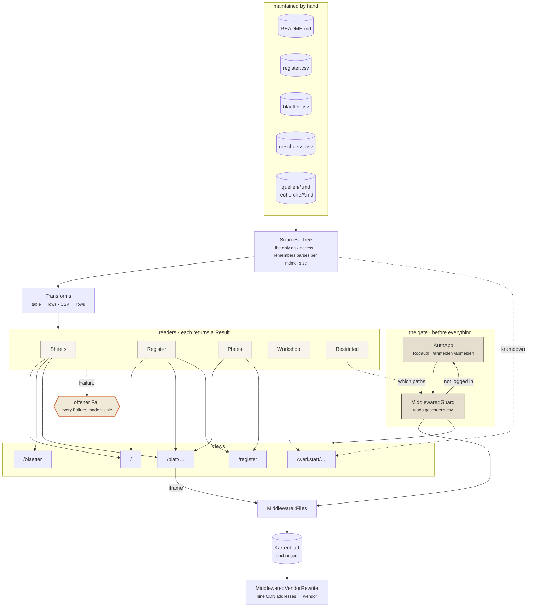

# The web application

Roda, dry-rb, one Puma process. How the atlas is served and what it is built
from. Orientation, the commands to start it and the Blätter tables are in
`README.md`; the sync between the clone and the design UI is in `TWO-PLACES.md`.

## Delivery and preview

The Blätter are static; the application around them is not. A Roda app serves the tree
and builds the home page, Schaukasten, Blattschau, Namensregister and Werkstatt out of
it. One process, no nginx. The commands are under "Getting it running" in `README.md`.

**Everything is read at runtime.** The sheet list comes from the tables in `README.md`,
the register from `atlas/register.csv`, the Blattschlüssel from `atlas/blaetter.csv`,
the prose from the `.md` files. A correction to a file is there on the next request;
there is no derived copy that can go quietly stale. Where something is missing, nothing
is guessed: the case appears as a visible box with path and reason — a Blatt without a
README row, a Blattnummer without a file, a link into nothing.

A Blatt stays reachable at its own address (`/Rumaenien-Physisch.html`), so every
cross-reference inside every Blatt keeps working; `/blatt/Rumaenien-Physisch.html` is
the framed view with its Quellenregister beside it.

Both **run without a network.** The Blätter would otherwise load d3, topojson, React and
Babel from unpkg and the world geometry from jsDelivr; `bin/vendor.rb` puts those nine
files under `/vendor` and a Rack middleware rewrites the references on the way out. The
Blätter themselves are untouched — they belong to the design project and must stay
byte-comparable. The `integrity` hashes keep validating because the vendored files are
byte-identical; `bin/vendor.rb` checks that and aborts otherwise.

The nine addresses live in **one** place, `web/lib/atlas/vendor.rb`. There used to be
three: twice as a `sub_filter` block in `web/nginx.conf`, once as a shell list in the
`Dockerfile` — two chances to update eight of nine.

Serving them ourselves has two reasons beyond the offline preview, and both hold in
public too: visitors' IP addresses do not go to third parties, and
`deutschlandGeoJSON@main` is a moving target — what a finished Blatt loads should not
change underneath it. The same argument as for keeping the generated geodata in the
repo.

Exactly **the nine vendored addresses** are rewritten, never the host. A prefix rule
would hit any unpkg URL: an upstream version bump would produce a `/vendor` path that
does not exist, and the Blatt would break on a 404. This way an unvendored version keeps
loading from the CDN — it degrades to the status quo instead of failing. A source note
citing a CDN URL in an `href` stays a working citation for the same reason.

Bodies over 512 KB are not even read on the way out. The largest file that carries one
of the nine is `support.js` at 69 KB; above the limit sit exactly two files, and neither
can match — `atlas/geodaten/verkehr-daten.js` is map data, and `_ds/_ds_bundle.js` cites
jsDelivr only for `speech-rule-engine` and `wicked-good-xpath`.

The only real network dependency left is the Overpass call in `Nikolais-Ort.dc.html` — a
live query that cannot be baked in. Without a network the Blatt draws from
`atlas/geodaten/friedhof-freiburg.geojson`.

## The path of a request

Top to bottom: the gate, the hand-maintained files, the one disk access, the readers,
the views. None of it is generated in advance — every edge is walked while the request
runs.

Four things the picture is meant to show:

1. **The gate comes before the file serving.** Two of the guarded paths are static files;
   a check inside the routing tree would never see them.
2. **`Sources::Tree` is the only disk access.** Everything else gets its data from
   there. That is why the remembering sits there too, and not five times beside it.
3. **Every reader empties into the same outlet for what is missing.** A `Failure` is not
   caught and smoothed over; it is drawn.
4. **The Kartenblatt sits outside.** It passes through the static layer unchanged and is
   only framed by the Blattschau — it hangs off no reader.

## What the application is built from

Roda routes, `dry-system` wires the readers, `dry-monads` brings the `Result`.

The last one is not decoration — every reader returns `Success` or `Failure`, and a
`Failure` becomes a visible box. That puts the project rule "fehlt ein Eintrag, wird
nicht geraten" into the return type rather than into the caller's diligence. A `nil` or
an empty list can be used by accident; a `Result` forces a decision before you reach the
value.

The parsers (`web/lib/atlas/transforms.rb`) are plain module functions. `dry-transformer`
sat there for a while; the reasoning for taking it out is in
`recherche/entscheidungen-webanwendung.md`, together with why `dry-monads` and
`dry-system` stay.

`web_pipe` was not taken, although its shape fits well: last release November 2021, last
commit November 2023, and the gemspec pins `rack ~> 2.0`.

`web/site.js` is **an enhancement, not a prerequisite.** The server delivers every page
complete, all 272 register rows included. The script places the Signaturen from
`atlas/signaturen.js` — the catalogue is a JS module, the browser is its natural reader,
and a second parser in Ruby would be a second place with its own opinion — and filters
the already-delivered table without a round trip. Without JavaScript the form filters by
GET, and every filtering is a shareable address.

## The gate

A small part of the atlas is not public: what shows a non-public person, or is written
about one. `web/geschuetzt.csv` lists those paths with a reason each, and is read at
runtime like every other table here.

**Rodauth, mounted as a Roda middleware in front of everything.** Not a branch of the
routing tree — two of the guarded paths are static files, a deck and a photograph, and
`Middleware::Files` answers those before Roda ever sees the request. `Atlas::AuthApp`
owns `/anmelden` and `/abmelden` and puts `rodauth` into the Rack env;
`Middleware::Guard` reads the list and decides what needs it. Rodauth knows how to
authenticate and nothing about this atlas; the list is an editorial decision.

A derived address inherits the guard of its content: `/blatt/X` and `/werkstatt/X` are
locked when `X` is. The entry still appears in Schaukasten and Werkstatt, marked
*nicht öffentlich* — hiding it would be a different answer than locking it.

**No database file and no volume.** Rodauth needs Sequel and a database, but not a file:
with only `:login` and `:logout` enabled it never writes. Measured, not assumed — a full
login and logout cycle issues zero `INSERT`, `UPDATE` or `DELETE`. So the single account
lives in an in-memory SQLite seeded at boot, the application stays stateless, the image
immutable and the dev bind mount read-only. The session is a signed cookie, so several
Puma workers need share nothing.

Three environment values, all required and none defaulted — a fallback secret is worse
than none, because nothing looks broken while it is in place:

| Variable | What |
|---|---|
| `ATLAS_KONTO` | the login name |
| `ATLAS_PASSWORT_HASH` | `ruby -rbcrypt -e 'print BCrypt::Password.create("…")'` |
| `ATLAS_SESSION_SECRET` | `ruby -rsecurerandom -e 'print SecureRandom.hex(64)'` |

`Sources::Restricted` **fails closed**: if the list cannot be read, every path counts as
guarded and the whole derived layer shuts rather than opens. Every other reader in this
application may fall back to an empty list; this one may not.

`test/web_test.rb` checks that every entry in the list really is guarded, that a guarded
*static* file is guarded too, and that logging in opens them — not that the list is
complete. It cannot check that, and neither can anything else: what is missing from the
list is public, and nothing reports it.

The host's Caddy still terminates TLS and routes the domain. Its `basicauth` block for
this service became redundant with the gate above; removing it is a change in `bmeise`
and belongs after a deploy that proves the gate works, not before.
