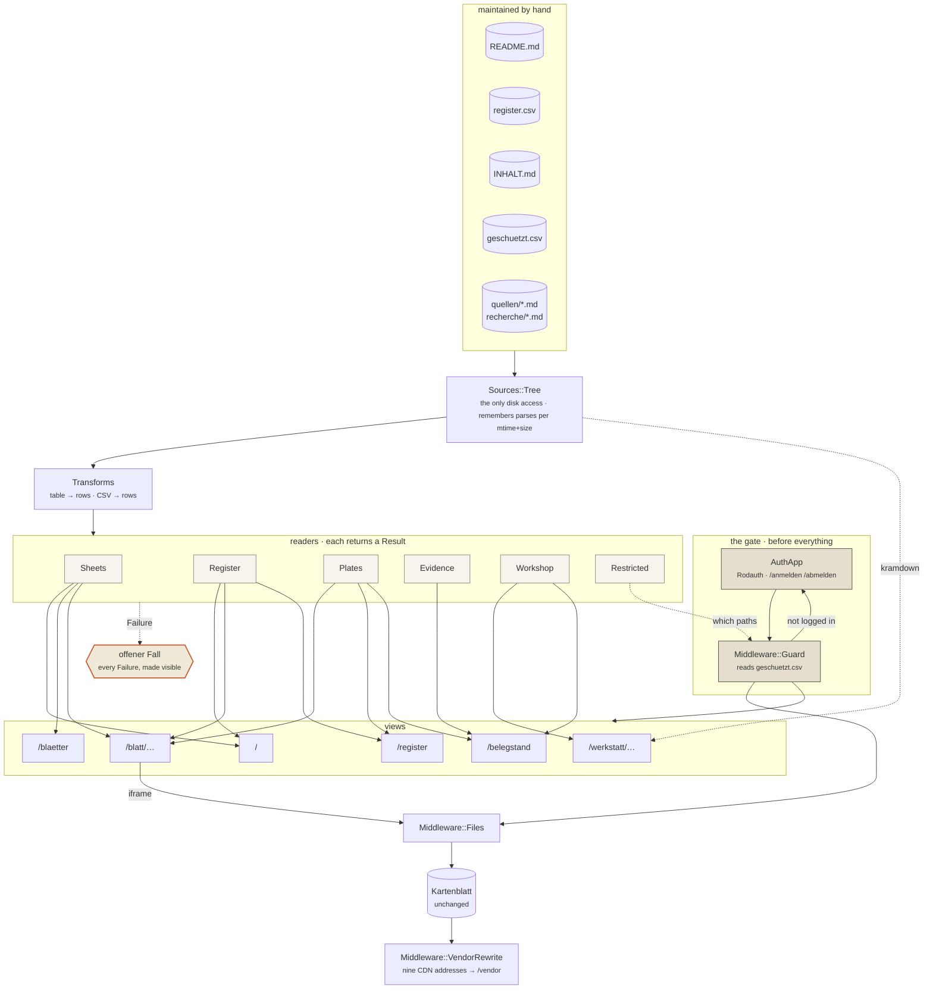

# The web application

Roda, dry-rb, one Puma process. How the atlas is served and what it is built
from. Orientation, the commands to start it and the Blätter tables are in
`README.md`; the sync between the clone and the design UI is in `doku/TWO-PLACES.md`.

## Delivery and preview

The Blätter are static; the application around them is not. A Roda app serves the tree
and builds the home page, Schaukasten, Blattschau, Namensregister and Werkstatt out of
it. One process, no nginx. The commands are under "Getting it running" in `README.md`.

**Everything is read at runtime.** The sheet list comes from the tables in `README.md`,
the register from `atlas/register.csv`, the contents from `atlas/INHALT.md`,
the prose from the `.md` files. A correction to a file is there on the next request;
there is no derived copy that can go quietly stale. Where something is missing, nothing
is guessed: the case appears as a visible box with path and reason — a Blatt without a
README row, a Blattnummer without a file, a link into nothing.

Same principle one step further in the Werkstatt: a note under `recherche/` moves itself
into the **Abgeschlossen** rubric by opening with a blockquote whose bold run starts
`Erledigt` — read while the request runs, so there is no list of finished notes to keep
in step with the directory. A note that says nothing stays among the running ones.

A Blatt stays reachable at its own address (`/Rumaenien-Physisch.html`), so every
cross-reference inside every Blatt keeps working; `/blatt/Rumaenien-Physisch.html` is
the framed view with its Quellenregister beside it.

Both **run without a network.** The Blätter would otherwise load d3, topojson, React and
Babel from unpkg and the world geometry from jsDelivr; `bin/vendor.rb` puts those nine
files under `/vendor` and a Rack middleware rewrites the references on the way out. The
Blätter themselves are untouched — they belong to the design project and must stay
byte-comparable. The `integrity` hashes keep validating because the vendored files are
byte-identical; `bin/vendor.rb` checks that and aborts otherwise.

The nine addresses live in **one** place, `web/lib/atlas/vendor.rb`. There used to be
three: twice as a `sub_filter` block in `web/nginx.conf`, once as a shell list in the
`Dockerfile` — two chances to update eight of nine.

Serving them ourselves has two reasons beyond the offline preview, and both hold in
public too: visitors' IP addresses do not go to third parties, and
`deutschlandGeoJSON@main` is a moving target — what a finished Blatt loads should not
change underneath it. The same argument as for keeping the generated geodata in the
repo.

Exactly **the nine vendored addresses** are rewritten, never the host. A prefix rule
would hit any unpkg URL: an upstream version bump would produce a `/vendor` path that
does not exist, and the Blatt would break on a 404. This way an unvendored version keeps
loading from the CDN — it degrades to the status quo instead of failing. A source note
citing a CDN URL in an `href` stays a working citation for the same reason.

Bodies over 512 KB are not even read on the way out. The largest file that carries one
of the nine is `support.js` at 69 KB; above the limit sit exactly two files, and neither
can match — `atlas/geodaten/verkehr-daten.js` is map data, and `_ds/_ds_bundle.js` cites
jsDelivr only for `speech-rule-engine` and `wicked-good-xpath`.

The only real network dependency left is the Overpass call in `Nikolais-Ort.dc.html` — a
live query that cannot be baked in. Without a network the Blatt draws from
`atlas/geodaten/friedhof-freiburg.geojson`.

## The path of a request

Top to bottom: the gate, the hand-maintained files, the one disk access, the readers,
the views. None of it is generated in advance — every edge is walked while the request
runs.

Five things the picture is meant to show:

0. **`Sources::Tree#parse` keys on the resolved path and a three-part stamp** —
   mtime, size and **ctime**. The first two can be made to recur with different
   contents (`cp -p`, `rsync -a`, a backup rollback), and a stamp that recurs
   would match forever, so a corrected file would stop appearing. ctime cannot be
   forged from userspace and comes out of the same `stat`.
1. **The gate comes before the file serving.** Two of the guarded paths are static files;
   a check inside the routing tree would never see them.
2. **`Sources::Tree` is the only disk access.** Everything else gets its data from
   there. That is why the remembering sits there too, and not five times beside it.
3. **Every reader empties into the same outlet for what is missing.** A `Failure` is not
   caught and smoothed over; it is drawn.
4. **The Kartenblatt sits outside.** It passes through the static layer unchanged and is
   only framed by the Blattschau — it hangs off no reader.

### The Belegstand

`/belegstand` reads the eight Quellenregister under `atlas/quellen/` as data rather than
as prose and counts them: what this atlas states, and what each statement stands on.
`/register` answers that per entry and the Blattschau per sheet; this is the only place
that answers it for the atlas as a whole.

It is the same rule the sheets already keep, applied one level up — and it needed a
reader because `App#sheet_sources` renders those files to opaque HTML, where a status is
prose. Both parses now run under their own tag, `:html` and `:evidence`, because
`Tree#parse` memoises per tag and two callers with different blocks must not share one
entry.

Three decisions carry it, and each is a place where the obvious shortcut is wrong:

- **Tables are recognised by their header, never by position.** The first column is
  spelled three ways across the registers; `Verkehr.md` carries a table whose columns
  are Element and Anmerkung, with prose where a status would be. Read by position, that
  one table alone yields dozens of invented status words. A table with no `Status`
  column is counted as skipped and named on the page.
- **Status words are not bent onto the three.** Nine registers carry six words, and
  `Nikolais-Ort.md` adds its own — "Angabe des Nutzers", "Erinnerung des Nutzers,
  wörtlich übernommen" — because a memory is marked as a memory rather than dressed up
  as a source. Unknown words are shown raw and counted apart, the way
  `Register::KIND_LABEL` handles an unknown kind. They also get no colour: colouring one
  in would be filing it under a category it does not belong to.
- **Only the sheets of the bound volume are held to having a register.** The
  Zeichenerklärung and the Einbandentwürfe make no claims about the world, so listing
  them as gaps would drown the two that are real.

## What the application is built from

Roda routes, `dry-system` wires the readers and carries the settings, `dry-monads` brings
the `Result`.

The last one is not decoration — every reader returns `Success` or `Failure`, and a
`Failure` becomes a visible box. That puts the project rule "fehlt ein Eintrag, wird
nicht geraten" into the return type rather than into the caller's diligence. A `nil` or
an empty list can be used by accident; a `Result` forces a decision before you reach the
value.

The parsers (`web/lib/atlas/transforms.rb`) are plain module functions. `dry-transformer`
sat there for a while; the reasoning for taking it out is in
`recherche/entscheidungen-webanwendung.md`, together with why `dry-monads` and
`dry-system` stay.

`web_pipe` was not taken, although its shape fits well: last release November 2021, last
commit November 2023, and the gemspec pins `rack ~> 2.0`.

`web/site.js` is **an enhancement, not a prerequisite.** The server delivers every page
complete, all 272 register rows included. The script places the Signaturen from
`atlas/signaturen.js` — the catalogue is a JS module, the browser is its natural reader,
and a second parser in Ruby would be a second place with its own opinion — and filters
the already-delivered table without a round trip. Without JavaScript the form filters by
GET, and every filtering is a shareable address.

## Build and publish

`.github/workflows/ci.yml` runs on every pull request and on every push to
`main`:

- **Tests** — `bin/vendor.rb` (the only step needing a network; its SRI check runs
  too), `test/web_test.rb`, and a smoke run of the report scripts.
- **Image** — `docker build`. On `main` it also pushes to
  `ghcr.io/yuszuv/diercki`, tagged `latest` and `sha-<commit>`, then pulls that
  image back, starts it and asks `/health`, `/version` and one Blatt — the CDN
  rewriting is the thing that would break quietly.

Nothing here deploys. The deploy stays `make webhost LIMIT=paketzentrum` in
bmeise, by hand.

**`/version` answers which commit is serving.** The build takes it as
`--build-arg ATLAS_REVISION`, because `.dockerignore` excludes `.git` and the
image cannot work it out for itself; CI passes the pushed SHA. Outside a built
image the route answers `arbeitsbaum` rather than inventing a value — a word that
can never be mistaken for a SHA.

bmeise's deploy compares this route against the commit it checked out and fails if
they differ. Without it a deploy can pull nothing, recreate nothing and still
report success: the checks around it ask whether a thing works, which stays true
while a stale container keeps answering. `/version` is public and unguarded like
`/health` — the commit is public anyway, and a check that needs a login has more
ways to fail than the thing it watches.

**Why the build moved off the server.** It used to happen there, on the argument
that the image is content rather than a compiled artefact. That was true while the
atlas was static HTML behind nginx. It stopped being true when the atlas grew a
Ruby application: the image now compiles `nio4r` and pulls platform-specific
`sqlite3` binaries, and a `Gemfile.lock` missing `x86_64-linux-musl` fails the
build — a failure that was previously discoverable only at deploy time, on the
server, in front of a live site.

It also puts this project back in line with what bmeise's own `dockerapp` role
asks for: *"Prefer pre-built images"*. `diercki` was the only `build: true` entry
across every host, and the role already handles both modes — `pull: always` when
`dockerapp_build` is unset. Nothing in the role changes.

`ATLAS_IMAGE` overrides the tag, so a deploy can pin `sha-<commit>` instead of
following `latest`.

The image carries three OCI labels and no others. Docker labels were Traefik's
service-discovery mechanism, and that layer was retired across bmeise in July
2026 — Caddy is configured from a templated Caddyfile driven by `web_apps`, not
from container metadata. The exception is
`org.opencontainers.image.source`: it is what links a package on ghcr to its
repository, without which the package floats unattached.

## The gate

A small part of the atlas is not on show: what shows a non-public person, or is written
about one. `web/geschuetzt.csv` lists those paths with a reason each, and is read at
runtime like every other table here.

**What the gate is and is not.** It guards addresses on the served site. The repository
is public, and the same files lie in it in plain sight — so this is a decision about
what the atlas *presents*, not a claim that anything here is secret. Taking an entry
off the list opens a page; taking a file out of the repository is a different act, and
the only one that would make it unavailable.

**Rodauth, mounted as a Roda middleware in front of everything.** Not a branch of the
routing tree — two of the guarded paths are static files, a deck and a photograph, and
`Middleware::Files` answers those before Roda ever sees the request. `Atlas::AuthApp`
owns `/anmelden` and `/abmelden` and puts `rodauth` into the Rack env;
`Middleware::Guard` reads the list and decides what needs it. Rodauth knows how to
authenticate and nothing about this atlas; the list is an editorial decision.

A derived address inherits the guard of its content: `/blatt/X` and `/werkstatt/X` are
locked when `X` is. The entry still appears in Schaukasten and Werkstatt, marked
*nicht öffentlich* — hiding it would be a different answer than locking it.

**No database file and no volume.** Rodauth needs Sequel and a database, but not a file:
with only `:login` and `:logout` enabled it never writes. Measured, not assumed — a full
login and logout cycle issues zero `INSERT`, `UPDATE` or `DELETE`. So the single account
lives in an in-memory SQLite seeded at boot, the application stays stateless, the image
immutable and the dev bind mount read-only. The session is a signed cookie, so several
Puma workers need share nothing.

Three environment values, all required and none defaulted — a fallback secret is worse
than none, because nothing looks broken while it is in place:

| Variable | What |
|---|---|
| `ATLAS_KONTO` | the login name |
| `ATLAS_PASSWORT_HASH` | `ruby -rbcrypt -e 'print [BCrypt::Password.create("…")].pack("m0")'` — **base64**, see below |
| `ATLAS_SESSION_SECRET` | `ruby -rsecurerandom -e 'print SecureRandom.hex(64)'` |

**Declared, not read by hand.** They are settings on the container, registered in
`web/boot.rb` through `dry-system`'s settings provider; the shape of each one lives in a
constructor next to its name. Every check runs before any of them is reported, so three
wrong values produce one message naming three faults. The `.env` reading comes with it —
dotenv's chain, `.env.<RACK_ENV>.local · .env.local` (never in test) · `.env.<RACK_ENV>`
· `.env`, with the environment winning over every file. Why this rather than reading
`ENV` by hand: `recherche/entscheidungen-webanwendung.md`.

`AuthApp` takes the secret while its class body runs, which is before
`Container.finalize!` in `config.ru`. That is not an oversight and needs no deferring: an
unfinalized `dry-system` container resolves lazily and starts the provider on the way.
Deferring would not be available anyway — `plugin :sessions` checks that `:secret` is a
String inside its own configure step and refuses a callable outright.

### Why the hash is base64

A bcrypt hash is `$2a$12$…`, three fields separated by dollar signs, and both readers of
a `.env` resolve those — Compose on the way into the container, dotenv when the
application reads the file without Docker. A raw hash arrives mangled or empty, the
application starts, and the correct password is simply rejected with nothing in any log
to say why.

Base64 has no dollar signs. The constructor in `web/boot.rb` decodes it and checks the
result against the bcrypt shape, so a raw one is a loud failure at start instead of a
quiet one at the login screen. The same applies to `dockerapp_env` in bmeise — it writes
exactly such a `.env`.

The measurements behind this, both paths with the mangled values, are recorded once in
`recherche/entscheidungen-webanwendung.md`.

`Sources::Restricted` **fails closed**: if the list cannot be read, every path counts as
guarded and the whole derived layer shuts rather than opens. Every other reader in this
application may fall back to an empty list; this one may not.

`test/web_test.rb` checks that every entry in the list really is guarded, that a guarded
*static* file is guarded too, and that logging in opens them — not that the list is
complete. It cannot check that, and neither can anything else: what is missing from the
list is public, and nothing reports it.

The host's Caddy still terminates TLS and routes the domain. Its `basicauth` block for
this service became redundant with the gate above and is gone — applied on 14.08.2026,
checked against the live site: the four guarded paths answer `302 → /anmelden` and carry
no `WWW-Authenticate`, so it is this application's guard that holds them, and an
unguarded Blatt still answers 200.

The sequence that got there mattered and is worth keeping in mind for the next such
swap: merge first, wait for the `Image` job to publish, deploy only then. Deploying
before the published image carries the gate would have rewritten Caddy without the
block while the old container kept serving the old tree — a window with no guard at
all. `recherche/bmeise-nachzuziehen.md` records how it ran.
